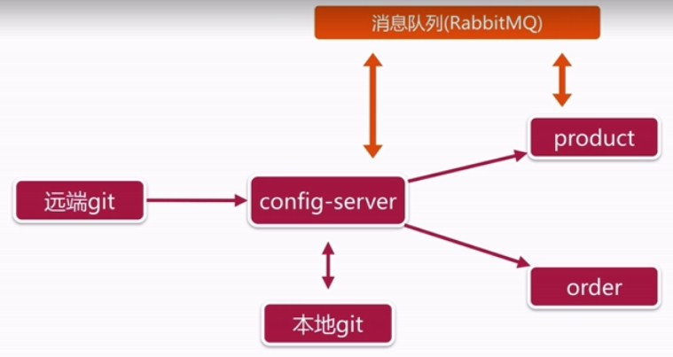

# SpringCloudDemo
商品微服务
# Eureka 服务注册与发现
- ***Eureka Server***  注册中心  
***pom***
```java
<dependency>
    <groupId>org.springframework.cloud</groupId>
    <artifactId>spring-cloud-starter-netflix-eureka-server</artifactId>
</dependency>
```
***Application***加注解  
```java
@EnableEurekaServer
```
***application.yml***
```yaml
## spring配置
spring:
  application:
    name: eureka
## 端口
server:
  port: 8761
## eureka相关配置
eureka:
  client:
    # 服务端可选false不进行自注册
    register-with-eureka: false
    # 服务注册地址
    service-url:
      defaultZone: http://127.0.0.1:8761/eureka/
```
- ***Eureka Client***  服务注册  
***pom***
```java
<dependency>
    <groupId>org.springframework.cloud</groupId>
    <artifactId>spring-cloud-starter-netflix-eureka-client</artifactId>
</dependency>
<dependency>
    <groupId>org.springframework.boot</groupId>
    <artifactId>spring-boot-starter-web</artifactId>
</dependency>
```
***Application***加注解  
```java
@EnableDiscoveryClient
```
***application.yml***
```yaml
spring:
  application:
    name: product
# eureka配置
eureka:
  client:
    service-url:
      defaultZone: http://127.0.0.1:8761/eureka/
```
### 服务发现分两种方法
- 客户端发现(客户端可知道后端服务数量，ip)
 - Eureka
- 服务端发现(代理。客户端对后端服务不可知)
 - Nginx
 - Zookeeper
# 微服务通信方式
- HTTP
  - SpringCloud
- RPC
  - Dubbo
# SpringCloud应用间通信方式
## 应用A  
- ***ServerController***
```java
@RestController
@RequestMapping
public class ServerController {

    @GetMapping("/msg")
    public String msg() {
        return "this is product";
  }
}
```
## 应用B
### RestTemplate实现  
- ***ClientController***
```java
package com.springclouddemo.order.controller;

import lombok.extern.slf4j.Slf4j;
import org.springframework.beans.factory.annotation.Autowired;
import org.springframework.cloud.client.ServiceInstance;
import org.springframework.cloud.client.loadbalancer.LoadBalancerClient;
import org.springframework.web.bind.annotation.GetMapping;
import org.springframework.web.bind.annotation.RestController;
import org.springframework.web.client.RestTemplate;

/**
 * author: mSun
 * date: 2018/10/15
 */
@RestController
@Slf4j
public class ClientController {

    @Autowired
    private LoadBalancerClient loadBalancerClient;

    @Autowired
    private RestTemplate restTemplate;

    @GetMapping("/getProductMsg")
    public String getProductMsg() {
        // 方法一（直接使用restTemplate,url写死）
//        RestTemplate restTemplate = new RestTemplate();
//        String url = "http://127.0.0.1:8080/msg";
//        String response = restTemplate.getForObject(url,String.class);

        // 方法二（利用loadBalancerClient通过应用名获取url,然后使用restTemplate获取）
//        ServiceInstance serviceInstance = loadBalancerClient.choose("PRODUCT");
//        RestTemplate restTemplate = new RestTemplate();
//        String url = String.format("http://%s:%s",serviceInstance.getHost(),serviceInstance.getPort()+"/msg");
//        String response = restTemplate.getForObject(url,String.class);

        // 方式三(利用@LoadBalanced进行注解配置，可在restTemplate里使用引用名)
        String response = restTemplate.getForObject("http://PRODUCT/msg", String.class);

        log.info("response={}", response);
        return response;
    }
}

```
- ***RestTemplateConfig***
```java
package com.springclouddemo.order.config;

import org.springframework.cloud.client.loadbalancer.LoadBalanced;
import org.springframework.context.annotation.Bean;
import org.springframework.stereotype.Component;
import org.springframework.web.client.RestTemplate;

/**
 * author: mSun
 * date: 2018/10/15
 */
@Component
public class RestTemplateConfig {

    @Bean
    @LoadBalanced
    public RestTemplate restTemplate() {
        return new RestTemplate();
    }
}
```
##### Robbin 上面利用LoadBalanced实现软负载均衡(默认轮循)
###### 主流程插件：
 - ServerList 获取所有可用服务列表
 - ServerListFilter 过滤一部分地址
 - IRule 选择一个实例作为请求地址
### Feign实现（伪RPC通信）  
- ***pom***
```
<dependency>
    <groupId>org.springframework.cloud</groupId>
    <artifactId>spring-cloud-starter-feign</artifactId>
    <version>1.4.5.RELEASE</version>
</dependency>
``` 
- ***Application*** 加注解
```java
@EnableFeignClients
```
- ***client.ProductClient*** 服务端请求映射
```java
package com.springclouddemo.order.client;

import org.springframework.cloud.openfeign.FeignClient;
import org.springframework.web.bind.annotation.GetMapping;

/**
 * author: mSun
 * date: 2018/10/16
 */
@FeignClient(name = "product")
public interface ProductClient {
    @GetMapping("/msg")
    String productMsg();
}

```
- ***ClientController***
```java
package com.springclouddemo.order.controller;

import com.springclouddemo.order.client.ProductClient;
import lombok.extern.slf4j.Slf4j;
import org.springframework.beans.factory.annotation.Autowired;
import org.springframework.web.bind.annotation.GetMapping;
import org.springframework.web.bind.annotation.RestController;


/**
 * author: mSun
 * date: 2018/10/15
 */
@RestController
@Slf4j
public class ClientController {

    @Autowired
    private ProductClient productClient;

    @GetMapping("/getProductMsg")
    public String getProductMsg() {

        String response = productClient.productMsg();
        log.info("response={}", response);
        return response;
    }
}

```
# 网关Zuul
## Zuul特点
- 路由+过滤器
## Zuul四种过滤器API
- 前置(Pre)
 - 限流
 - 鉴权
 - 参数校验
- 路由(Route)
- 后置(Post)
 - 统计
 - 日志
- 错误(Error)

## 基本配置使用
***pom***
```
<dependency>
    <groupId>org.springframework.cloud</groupId>
    <artifactId>spring-cloud-starter-netflix-eureka-client</artifactId>
</dependency>
<dependency>
    <groupId>org.springframework.cloud</groupId>
    <artifactId>spring-cloud-starter-netflix-zuul</artifactId>
</dependency>
```
***Application注解***
```java
@EnableZuulProxy
```
***application配置文件***
```yaml
zuul:
  # 全局cookie透传
  sensitive-headers:
  routes:
  # 路由配置
  # /myProduct/product/list -> /product/product/list
    myProduct:
      path: /myProduct/**
      serviceId: product
      # cookie 设置空表示透传
      sensitiveHeaders:
    # 简写
#    product: /myProduct/**
  # 路由过滤(不允许访问路由)
  ignored-patterns:
    - /**/product/list
```
***ZuulConfig 动态路由配置***
```java
/**
 * Zuul动态路由自动配置注入(配合配置中心使用)
 * author: mSun
 * date: 2018/10/22
 */
@Component
public class ZuulConfig {

    @RefreshScope
    @ConfigurationProperties("zuul")
    public ZuulProperties zuulProperties() {
        return new ZuulProperties();
    }
}
```
## Filter
#### 前置FRE 过滤器
```java
/**
 * 前置拦截器
 * author: mSun
 * date: 2018/10/22
 */
@Component
public class TokenFilter extends ZuulFilter {

    // 过滤器类型
    @Override
    public String filterType() {
        return PRE_TYPE;
    }

    // 过滤器位置
    @Override
    public int filterOrder() {
        return PRE_DECORATION_FILTER_ORDER - 1;
    }

    @Override
    public boolean shouldFilter() {
        return true;
    }

    @Override
    public Object run() throws ZuulException {
        RequestContext requestContext =RequestContext.getCurrentContext();
        HttpServletRequest request = requestContext.getRequest();
        // 从url参数获取，也可从cookie、header获取
        String token = request.getParameter("token");
        if (StringUtils.isEmpty(token)) {
            requestContext.setSendZuulResponse(false);
            requestContext.setResponseStatusCode(HttpStatus.UNAUTHORIZED.value());
        }
        return null;
    }
}

```
#### 后置POST 过滤器
```java
/**
 * 后置拦截器
 * author: mSun
 * date: 2018/10/22
 */
@Component
public class AddResponseHeaderFilter extends ZuulFilter {
    @Override
    public String filterType() {
        return POST_TYPE;
    }

    @Override
    public int filterOrder() {
        return SEND_RESPONSE_FILTER_ORDER - 1;
    }

    @Override
    public boolean shouldFilter() {
        return true;
    }

    @Override
    public Object run() throws ZuulException {
        RequestContext requestContext = RequestContext.getCurrentContext();
        HttpServletResponse response = requestContext.getResponse();
        response.setHeader("X-Foo", UUID.randomUUID().toString());
        return null;
    }
}
```
## 限流拦截
```java
/**
 * 限流拦截器
 * author: mSun
 * date: 2018/10/22
 */
@Component
public class RateLimitFilter extends ZuulFilter {

    // 限流令牌桶算法，取得令牌数。类似买房发号。
    private static final RateLimiter RATE_LIMITER = RateLimiter.create(100);

    @Override
    public String filterType() {
        return PRE_TYPE;
    }

    // 级别最高，所有过滤器之前
    @Override
    public int filterOrder() {
        return SERVLET_DETECTION_FILTER_ORDER - 1;
    }

    @Override
    public boolean shouldFilter() {
        return true;
    }

    @Override
    public Object run() throws ZuulException {

        // 取令牌，如果没有抛异常。
        if (!RATE_LIMITER.tryAcquire()) {
            throw new RateLimitException();
        }
        return null;
    }
}
```
# Hystrix
- 服务降级
- 依赖隔离
- 服务熔断
- 监控(Hystrix Dashboard)
## 服务降级
- 优先核心服务，非核心服务不可用或弱可以
- 通过HysrixCommand注解指定
- fallbackMethod实现降级逻辑
***pom***
```
<dependency>
    <groupId>org.springframework.cloud</groupId>
    <artifactId>spring-cloud-starter-hystrix</artifactId>
    <version>1.4.5.RELEASE</version>
</dependency>
```
***Application***
```java
//@SpringBootApplication
//@EnableDiscoveryClient
//@EnableCircuitBreaker
@SpringCloudApplication
```
***测试Controller***
```java
/**
 * Hystrix测试用例
 * author: mSun
 * date: 2018/10/23
 */
@RestController
// 默认降级调用，@HystrixCommand可不写回调方法
@DefaultProperties(defaultFallback = "defaultFallback")
public class HystrixController {

    // 异常降级，fallbackMethod回调fallback
    // 超时降级设置，默认1000ms
//    @HystrixCommand(fallbackMethod = "fallback",commandProperties = {
//            @HystrixProperty(name = "execution.isolation.thread.timeoutInMilliseconds", value = "2000")
//    })
    // 熔断配置
    @HystrixCommand(commandProperties = {
            @HystrixProperty(name = "circuitBreaker.enabled", value = "true"), //设置熔断
            // 请求次数达到10次后，错误率超过60%,服务默认休眠（不可用）1000ms
            @HystrixProperty(name = "circuitBreaker.requestVolumeThreshold", value = "10"), // 请求次数达到数
            @HystrixProperty(name = "circuitBreaker.sleepWindowInMilliseconds", value = "1000"), // 默认服务不可用时间
            @HystrixProperty(name = "circuitBreaker.errorThresholdPercentage", value = "60") // 错误率
    })
    @GetMapping("/getProductInfoList")
    public String getProductInfoList() {
        RestTemplate restTemplate = new RestTemplate();
        return restTemplate.postForObject("http://127.0.0.1:8080/product/listForOrder",
                Arrays.asList("157875227953464068"),
                String.class);
//        throw new RuntimeException("抛错，降级回调");
    }

    // 回调
    private String fallback() {
        return "太拥挤了（服务异常）";
    }

    private String defaultFallback() {
        return "默认降级回调方法";
    }
}

```
#### 设置默认熔断器配置
***application.yml***
```
# 熔断器默认配置
hystrix:
  command:
    # default可修改成其他名
    default:
      # 此处配置具体参数（见HystrixCommandProperties类）
      execution:
        isolation:
          thread:
            timeoutInMilliseconds: 2000
```
***调用conttroller***
```java
// 熔断设置（commandKey默认default，可设置对应名）
@HystrixCommand(commandKey="")
```
### 熔断可视化
***pom***
```
<dependency>
    <groupId>org.springframework.cloud</groupId>
    <artifactId>spring-cloud-starter-hystrix-dashboard</artifactId>
    <version>1.4.5.RELEASE</version>
</dependency>
<dependency>
    <groupId>org.springframework.boot</groupId>
    <artifactId>spring-boot-starter-actuator</artifactId>
</dependency>
```
***Application***
```
@EnableHystrixDashboard
```
***application.yml***
```
management:
  endpoints:
    web:
      exposure:
        include: '*'
```
访问http://127.0.0.1/hystrix 按示例填写
# 服务追踪
***pom***
```
<!--包含sleuth和zipkin-->
<dependency>
    <groupId>org.springframework.cloud</groupId>
    <artifactId>spring-cloud-starter-zipkin</artifactId>
</dependency>
<!--<dependency>-->
    <!--<groupId>org.springframework.cloud</groupId>-->
    <!--<artifactId>spring-cloud-starter-sleuth</artifactId>-->
<!--</dependency>-->
<!--<dependency>-->
    <!--<groupId>org.springframework.cloud</groupId>-->
    <!--<artifactId>spring-cloud-sleuth-zipkin</artifactId>-->
<!--</dependency>-->
```
引入即开启
***application.yml*** 调整日志级别，数据进行外部传输
```
logging:
  level:
    org.springframework.cloud.openfeign: debug
spring:
  zipkin:
    base-url: http://127.0.0.1:9411/
  sleuth:
    sampler:
      # 采集百分比（默认0.1）
      probability: 1
```
使用zipkin查看路由追踪(https://zipkin.io/)
# ConfigServer统一配置
*  方便维护
*  配置内容安全与权限
*  更新配置项目需要重启解决
## 基本架构图


## 基本配置使用(环境有git)
### Server端
***pom***
```
<dependency>
    <groupId>org.springframework.cloud</groupId>
    <artifactId>spring-cloud-starter-netflix-eureka-client</artifactId>
</dependency>
<dependency>
    <groupId>org.springframework.cloud</groupId>
    <artifactId>spring-cloud-config-server</artifactId>
</dependency>
```
***Application加注解***
```java
@EnableDiscoveryClient
@EnableConfigServer
```
***application.yml***
```yaml
spring:
  application:
    name: config
  cloud:
    config:
      server:
        git:
          # github项目地址
          uri: https://github.com/msun1996/SpringCloudDemo
          # 配置存储配置文件路径
          search-paths: config-repo
          username: msun1996
          password: hzy960304
          strict-host-key-checking: false
          # 本地存放目录
          # basedir: C:/Users/HANZHA~1/AppData/Local/Temp/config-repo-4928935862373680079/config-repo/user.yml
eureka:
  client:
    service-url:
      defaultZone: http://localhost:8761/eureka/
```
***测试访问***
```
# github地址：https://github.com/msun1996/SpringCloudDemo/blob/master/config-repo/user.yml
# 访问地址：http://127.0.0.1:8080/user-dev.yml
## 常用访问格式：
/{name}-{profiles}.yml
/{label}/{name}-{profiles}.yml
name 服务名
profiles 环境
label 分支(branch)
(如果环境中有a.yml,a-dev.yml, 配置文件读取a-dev.yml时会读取a.yml,a-dev.yml配置文件合并后文件作为配置文件)
```

### Client端
***pom***
```
<dependency>
    <groupId>org.springframework.cloud</groupId>
    <artifactId>spring-cloud-config-client</artifactId>
</dependency>
```
***bootstrap.yml***
> 必须使用bootstrap.yml,在所有程序启动前运行拉取配置文件
```yaml
spring:
  application:
    name: user
  cloud:
    config:
      discovery:
        enabled: true
        service-id: CONFIG
      profile: dev
# 通过eureka获取CONFIG服务，需配置这里
eureka:
  client:
    service-url:
      defaultZone: http://localhost:8761/eureka/
```

## SpringCloud Bus配置动态刷新
### Server端
***pom***
```
<dependency>
 <groupId>org.springframework.cloud</groupId>
 <artifactId>spring-cloud-starter-bus-amqp</artifactId>
</dependency>
```
***application.yml***
```yaml
management:
  endpoints:
    web:
      exposure:
        include: "*"
# rabbitmq使用默认连接,可以不配，使用匿名用户创建
#spring:
#  rabbitmq:
#    host: 127.0.0.1
#    port: 5672
#    username: guest
#    password: guest
```
### Client端
***pom***
```
<dependency>
 <groupId>org.springframework.cloud</groupId>
 <artifactId>spring-cloud-starter-bus-amqp</artifactId>
</dependency>
```
***config.java(或属性配置类上加注解)***
```java
# 加注解才会生效
@RefreshScope
```
### github配置Webhook
```java
（手动请求刷新 post 127.0.0.1:8080/actuator/bus-refresh )
设置地址： http://127.0.0.1:8080/actuator/bus-refresh (http://127.0.0.1:8080/monitor)
格式：application/json
```
